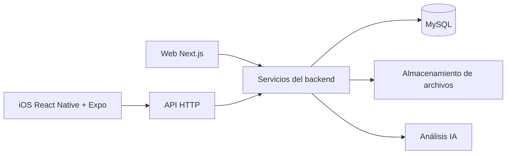

# Exploración y propuesta de desarrollo: Mi Saluteca para iOS

Fecha: 17 de septiembre de 2026.
Estado: propuesta para revisión; implementación pendiente.

## Objetivo

Desarrollar una versión iOS de Mi Saluteca con React Native, compilable y distribuible mediante GitHub Actions utilizando runners macOS. Mantener la aplicación web y compartir el backend existente.

## Recomendación

Crear una aplicación React Native con Expo en `mobile/`, dentro del repositorio actual y con dependencias propias. Conservar Next.js como aplicación web y backend, exponiendo una API HTTP para el cliente móvil. Compartir contratos TypeScript, validaciones y funciones puras cuando estén separadas de dependencias web y de servidor.

Validar temprano un IPA compilado en GitHub Actions e instalado mediante Impactor con una cuenta Apple gratuita, y un recorrido funcional completo antes de reconstruir todas las pantallas. Postergar la membresía de pago hasta incorporar TestFlight o publicar en App Store. La compatibilidad del circuito de sideloading debe comprobarse con una build mínima.

## Estado actual observado

La exploración se realizó mediante lectura del código. No se modificó código de producción ni se ejecutaron tests, builds o verificaciones del servidor desplegado.

- Stack: Next.js 16.1.1, React 19.2.3, TypeScript, Bootstrap y React Bootstrap.
- Backend existente: MySQL mediante `mysql2`, autenticación Google con NextAuth v4, carga de archivos, enlaces compartidos y análisis con IA.
- Las operaciones de negocio utilizan principalmente Server Actions. Existen endpoints HTTP de autenticación y archivos, pero no una API CRUD completa para móvil.
- Los endpoints privados de archivos dependen de `getServerSession`; actualmente no validan un token Bearer móvil.
- Los archivos se almacenan en el filesystem del servidor, mediante `DIRECTORY_UPLOADS` o `./uploads`. S3/R2 aparecen como intención en la documentación, no como integración implementada.
- La carga permite múltiples archivos: hasta 10 y un límite declarado de 10 MB por archivo. El contrato móvil debe representar `files[]` y selección por `fileId`.
- El OCR activo se ejecuta en navegador. La integración con OpenAI se ejecuta en servidor.
- Los enlaces públicos `/s/[token]` expiran 24 horas después del primer acceso y pueden revocarse.
- No se encontró `.github` ni un runner de tests configurado en los scripts de `package.json`.
- OpenSpec no está inicializado en el proyecto; la skill `openspec-explore` no está instalada. Este documento es una exploración técnica, no un change formal de OpenSpec.

El README y parte de la documentación técnica están desactualizados: describen backend pendiente y tecnologías recomendadas que no coinciden con la implementación actual.

## Reutilización y adaptación

| Componente actual | Tratamiento propuesto |
| --- | --- |
| Tipos, validaciones y funciones puras | Compartir después de aislar dependencias web/servidor |
| Servicios de negocio y repositorios MySQL | Conservar en backend y exponer mediante HTTP |
| Pantallas Bootstrap, CSS y navegación Next.js | Reconstruir con componentes React Native |
| Server Actions | Mantener para web y ofrecer contratos HTTP para móvil |
| Autenticación NextAuth basada en sesión web | Diseñar un flujo móvil explícito |
| OCR de navegador | Reemplazar por procesamiento de backend o una solución nativa evaluada |
| Enlaces públicos compartidos | Conservar HTTPS y compartir mediante las funciones nativas de iOS |
| Administración y páginas institucionales | Mantener inicialmente en web |

## Arquitectura propuesta

No importar código MySQL, secretos, Server Actions ni SDKs exclusivos del servidor en la aplicación móvil. Evitar una reorganización masiva del repositorio como requisito previo al MVP; extraer código compartido según necesidades concretas.

### API y contratos

Definir contratos HTTP versionados para sesión/usuario, estudios, familia, enlaces compartidos y archivos. Reutilizar servicios existentes sin duplicar reglas de negocio. Distinguir explícitamente respuestas vacías, errores y sesiones vencidas; algunas acciones actuales devuelven `[]` o `null` ante fallos.

### Autenticación

Diseñar inicio de sesión móvil, renovación, cierre de sesión y vinculación estable con los usuarios existentes. No asumir que `next-auth/react` o las cookies web funcionan directamente como autenticación nativa. Evaluar almacenamiento de credenciales mediante Expo SecureStore.

Los cambios de autenticación y seguridad requieren revisión y aprobación humana antes de escribir código, conforme a las reglas del proyecto.

### Archivos y OCR

Para el MVP, permitir selección desde Files/fotos, carga de documentos y entrada manual de metadatos. Validar apertura de PDF e imágenes en un iPhone real.

Posteriormente, incorporar extracción y análisis en backend, distinguiendo PDF digital, documentos escaneados, imágenes y DOCX. Evaluar procesamiento asincrónico con progreso y reintentos. El OCR nativo puede evaluarse como optimización posterior.

Mantener inicialmente el filesystem si el despliegue dispone de disco persistente. Una migración a almacenamiento de objetos debe tratarse como una decisión separada y revisarse antes de modificar la configuración que afecta datos.

### Compartir

Conservar los enlaces públicos web y su regla de expiración desde el primer acceso. Utilizar compartir nativo para enlaces y, cuando corresponda, archivos. Universal Links pueden añadirse posteriormente.

## Compilación y distribución con GitHub Actions

Expo permite generar el proyecto nativo con `expo prebuild`. Las personalizaciones deben expresarse mediante configuración y plugins si se adopta generación reproducible, evitando cambios manuales que se perderían al regenerar.

| Disparador | Verificación o entrega |
| --- | --- |
| Pull request | Tipos, lint, tests y compilación para simulador |
| Ejecución manual durante pruebas iniciales | Build Release para dispositivo físico, empaquetada como IPA para firma e instalación local con Impactor |
| Tag de versión o ejecución manual tras contratar membresía | Archive firmado, exportación `.ipa` y subida a TestFlight |

### Pruebas iniciales sin membresía de pago

Compilar para un iPhone físico (`iphoneos`, no `iphonesimulator`) con firma deshabilitada en CI y empaquetar la aplicación como `Payload/MiSaluteca.app` dentro del IPA. Incluir el bundle JavaScript y assets en una build Release para que no dependa de Metro. No utilizar la exportación App Store como mecanismo para generar este artefacto sin firma.

Descargar el artefacto y usar Impactor, antes denominado Plume Impactor, en la computadora local para solicitar el certificado/perfil de la cuenta gratuita, firmar e instalar en el iPhone. El IPA sin firma no se puede instalar directamente. Las credenciales Apple utilizadas por el sideloader permanecen fuera del pipeline propuesto.

Apple permite pruebas personales con cuenta gratuita, con perfiles que expiran a los siete días, límites de registro y capacidades restringidas. Será necesario renovar la firma periódicamente; no equivale a distribución TestFlight o App Store. Validar por separado cualquier funcionalidad que requiera capabilities no disponibles con Personal Team.

La compilación y el empaquetado sin firma son una estrategia técnica a validar para este proyecto, no un circuito ya ejecutado. Los costos de runners GitHub Actions son independientes de la membresía Apple.

### Distribución posterior con membresía de pago

Pipeline propuesto para TestFlight/App Store:

1. Obtener el código e instalar dependencias desde lockfiles.
2. Seleccionar una imagen macOS y una versión de Xcode compatibles y controladas.
3. Generar el proyecto iOS e instalar CocoaPods.
4. Importar certificado y provisioning profile en un keychain temporal.
5. Compilar y exportar el archivo firmado mediante Fastlane/Xcode.
6. Guardar artefactos y subir el build a App Store Connect/TestFlight.

Ejecutar verificaciones JavaScript/TypeScript en Linux cuando sea posible y reservar macOS para compilaciones y verificaciones nativas.

GitHub proporciona el runner macOS; no es necesario montar manualmente un sistema operativo. El backend debe continuar desplegado de forma independiente del proceso de build móvil.

### Requisitos de distribución TestFlight/App Store

Estos requisitos no bloquean las pruebas iniciales mediante sideloading. Apple Developer Program cuesta 99 USD por año, o su equivalente local donde esté disponible.

- Cuenta Apple Developer con acceso adecuado a App Store Connect.
- Bundle identifier y registro de aplicación.
- Certificado de distribución con su clave privada y provisioning profile compatible.
- Credenciales de App Store Connect para automatizar la subida.
- GitHub Secrets para material sensible y configuración de entorno.
- Versionado y número de build únicos por entrega.

La clave de App Store Connect utilizada para subir builds no sustituye el certificado y perfil necesarios para firmar el binario.

Como alternativa, `eas build --local` puede ejecutar el proceso en el runner macOS; requiere autenticación con Expo y tiene limitaciones propias. La opción recomendada inicialmente es Expo Prebuild con Fastlane/Xcode para controlar el pipeline en GitHub Actions.

## Alcance inicial y secuencia de desarrollo

### Hito 1: compilación e instalación mediante sideloading

Crear una aplicación mínima, generar un IPA Release para iPhone en GitHub Actions y firmarlo/instalarlo localmente con Impactor usando una cuenta gratuita. Comprobar apertura, recursos incluidos y funcionamiento sin Metro. Resolver versiones de herramientas y compatibilidad de firma antes de invertir en todas las pantallas. Incorporar firma de distribución y TestFlight posteriormente, cuando se contrate la membresía.

### Hito 2: recorrido funcional completo

Implementar y validar en iPhone real:

1. Iniciar sesión con un usuario existente.
2. Consultar su listado de estudios desde el backend.
3. Descargar y abrir un PDF autorizado.
4. Cerrar sesión y comprobar que se bloquea el acceso privado posterior.

### Hito 3: MVP nativo

- Inicio con estudios recientes y métricas.
- Listado, búsqueda, filtros y detalle de estudios.
- Grupo familiar y sus estudios.
- Carga multiarchivo desde Files/fotos con metadatos manuales.
- Edición y eliminación de estudios.
- Generación, compartición y revocación de enlaces.
- Configuración y eliminación de cuenta.

### Hito 4: extracción y análisis automático

Recuperar el autocompletado de metadatos mediante procesamiento de documentos compartido en backend, con estados de progreso, errores y reintentos. Validar formatos y límites con documentos representativos.

## Riesgos y decisiones pendientes

| Tema | Riesgo o decisión necesaria |
| --- | --- |
| Autenticación | Definir flujo móvil y asociación con cuentas existentes sin afectar la web |
| API | Evitar duplicación de lógica y distinguir fallos de resultados vacíos |
| Arquitectura en transición | Coexisten `src/features`, acciones legacy y utilidades duplicadas; identificar el flujo activo antes de adaptarlo |
| Migración multiarchivo | Persisten consultas a columnas legacy como `estudios.file_key`; no asumir que es seguro eliminarlas |
| Metadatos | Se observó una inconsistencia `doctor`/`medico`; acordar un contrato consistente |
| Persistencia | Confirmar infraestructura y almacenamiento persistente del servidor desplegado |
| Experiencia nativa | Selección, descarga, apertura y compartición de documentos requieren prueba real en iPhone |
| Calidad | Incorporar un runner de tests y aplicar TDD durante la implementación según las reglas del proyecto |
| Pruebas iniciales | Validar IPA para dispositivo y firma con Impactor/cuenta gratuita; renovar perfil cada siete días |
| Distribución posterior | Confirmar titularidad/acceso Apple Developer de pago y disponibilidad de firma para TestFlight/App Store |
| Alcance | Sideloading como primera entrega; decidir qué funciones posteriores quedan fuera del MVP |

No se propone soporte offline, HealthKit ni notificaciones como requisito inicial. Su incorporación debe evaluarse según necesidad de producto.

## Preparación para publicación

Contemplar política de privacidad accesible, declaraciones de uso de datos y eliminación de cuenta dentro de la app cuando permita crear cuentas. Si se mantiene Google como login principal, evaluar la opción equivalente exigida por Apple, normalmente Sign in with Apple, salvo una excepción aplicable.

La subida a TestFlight y la publicación en App Store son pasos distintos; la publicación requiere completar los requisitos y la revisión de Apple.

## Evidencias del repositorio

- `package.json`: stack y scripts disponibles.
- `src/lib/auth/config.ts`: autenticación Google y sesión NextAuth.
- `app/api/auth/[...nextauth]/route.ts`: ruta de autenticación activa.
- `src/features/studies/api/get-studies.ts`: consultas mediante Server Actions.
- `src/features/*/services` y `src/features/*/repositories`: capas reutilizables en servidor.
- `app/api/upload-study/route.ts`: carga multipart y persistencia filesystem.
- `app/api/download-study/[uuid]`: descarga privada de archivos.
- `components/modals/UploadStudyModal.tsx` y `lib/ocr-utils.ts`: procesamiento OCR de navegador activo.
- `src/lib/ai/ocr-utils.ts`: implementación duplicada con dependencias de DOM/canvas.
- `src/features/studies/services/analyze-study.service.ts`: integración IA en servidor.
- `app/s/[token]/actions.ts`: acceso y expiración de enlaces compartidos.
- `database/migrate-multiple-files.sql`: transición a múltiples archivos.

## Referencias técnicas

- [Expo: generación del proyecto nativo](https://docs.expo.dev/workflow/continuous-native-generation/).
- [Expo: development builds](https://docs.expo.dev/develop/development-builds/introduction/).
- [Expo: compilación local con EAS](https://docs.expo.dev/build-reference/local-builds/).
- [Expo SecureStore](https://docs.expo.dev/versions/latest/sdk/securestore/).
- [Expo DocumentPicker](https://docs.expo.dev/versions/latest/sdk/document-picker/).
- [Expo Sharing](https://docs.expo.dev/versions/latest/sdk/sharing/).
- [GitHub Actions: elección de runners](https://docs.github.com/en/actions/how-tos/write-workflows/choose-where-workflows-run/choose-the-runner-for-a-job).
- [GitHub Actions: certificados y firma de Xcode](https://docs.github.com/en/actions/how-tos/deploy/deploy-to-third-party-platforms/sign-xcode-applications).
- [Fastlane: build y exportación](https://docs.fastlane.tools/actions/build_app/).
- [Fastlane: App Store Connect API](https://docs.fastlane.tools/app-store-connect-api/).
- [Apple: subida de builds](https://developer.apple.com/help/app-store-connect/manage-builds/upload-builds).
- [Apple: reglas de revisión](https://developer.apple.com/app-store/review/guidelines/).
- [Apple: comparación de membresías y límites de Personal Team](https://developer.apple.com/support/compare-memberships/).
- [Impactor: repositorio oficial y funcionamiento de firma](https://github.com/claration/Impactor).

## Próximo paso propuesto

Revisar el alcance y el diseño de autenticación/API. Convertir esta exploración en una propuesta de desarrollo con tareas y criterios de aceptación, empezando por el circuito GitHub Actions → IPA → Impactor → iPhone y el recorrido login → estudios → PDF. Agregar TestFlight al contratar la membresía de pago.
